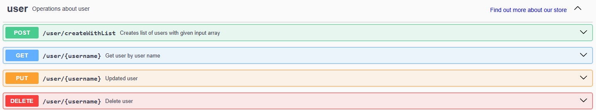

# [Desafio 3] Automação do login PetStore

### Automação do login

https://petstore.swagger.io/#/

Neste desafio você irá implementar do zero uma automação dos quatro endpoints apresentados na imagem utilizando Behave e Requests. O objetivo é validar cada operação garantindo que todas as funcionalidades estejam funcionando corretamente.
Para este desafio você deve criar um novo projeto, que nem mencionado anteriormente.

Requisitos:

Bibliotecas Necessárias:
- Behave
- Requests

 Objetivo:

### 1. POST: Criar Usuários:

+ **<u>Endpoint:</u>** 
/user/createWithList

+ **<u>Descrição:</u>** Validação da criação uma lista de usuários com as informações dadas.
Tarefa: Realizar uma requisição POST enviando uma lista com pelo menos um usuário, incluindo todos os campos necessários. A resposta do endpoint deve ser validada, garantindo que:
O código de status retornado seja 200 OK.
O corpo da resposta contenha o campo message com o valor "ok".

### 2. GET: Obter Usuário
+ **<u>Endpoint:</u>** /user/{username}

+ **<u>Descrição:</u>** Obtém os detalhes usuário pelo username
Tarefa: Realizar uma requisição GET fornecendo o nome de um usuário e validar se os detalhes retornados estão corretos. A resposta do endpoint deve ser validada, garantindo que:
O código de status retornado seja 200 OK.
O corpo da resposta contenha as informações descritas no swagger.

### 3. PUT: Atualizar Usuário
+ **<u>Endpoint:</u>** /user/{username}
+ **<u>Descrição:</u>** Atualiza os detalhes de um usuário existente.
Tarefa: Realizar uma requisição PUT para atualizar as informações de um usuário e validar se as mudanças foram aplicadas com sucesso. A resposta do endpoint deve ser validada, garantindo que:
O código de status retornado seja 200 OK.

### 4. DELETE: Excluir Usuário
+ **<u>Endpoint:</u>** /user/{username}
+ **<u>Descrição:</u>** Remove um usuário com base no nome de usuário fornecido.
Tarefa: Realizar uma requisição DELETE para excluir um usuário e verificar se ele foi removido corretamente. A resposta do endpoint deve ser validada, garantindo que:
O código de status retornado seja 200 OK.